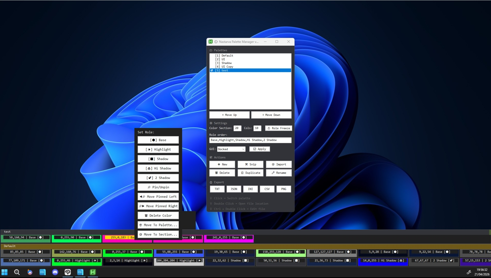
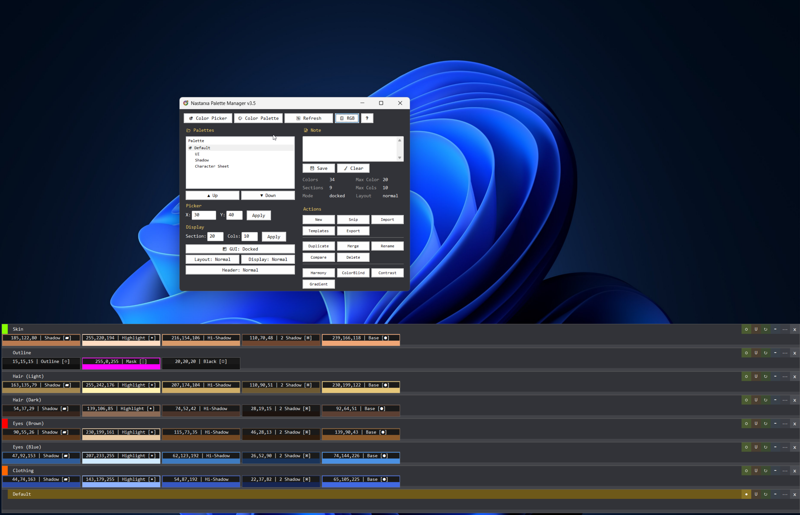
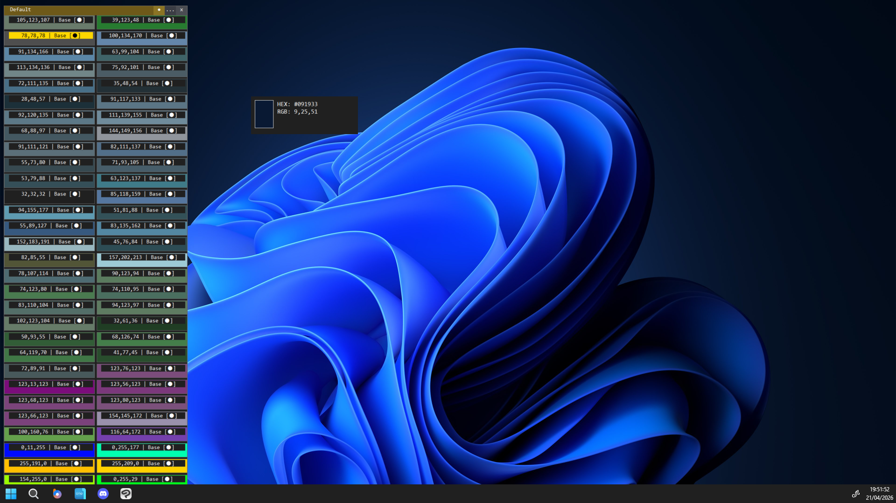
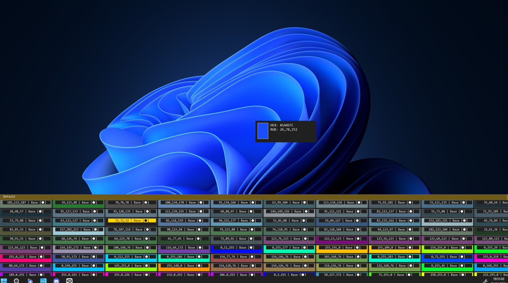
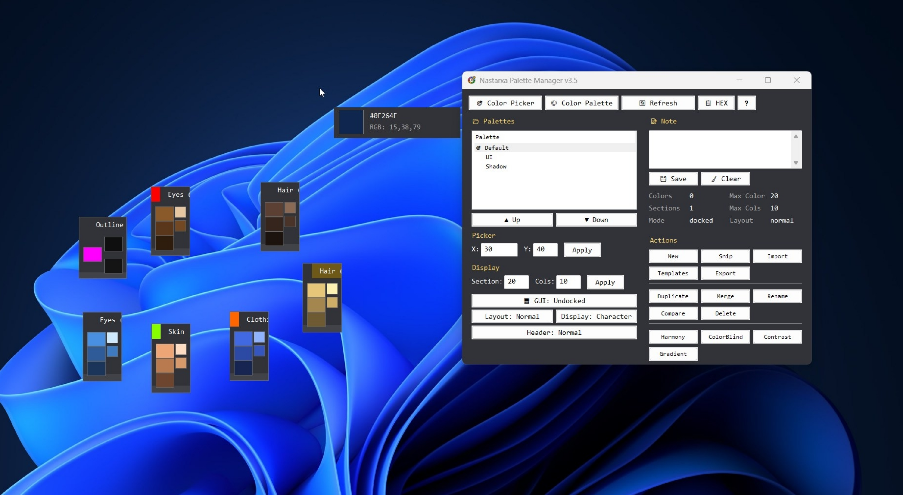
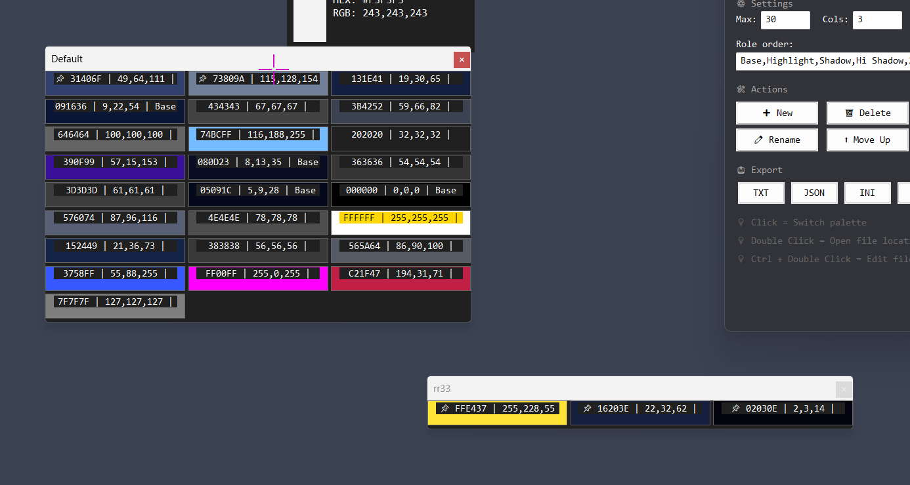
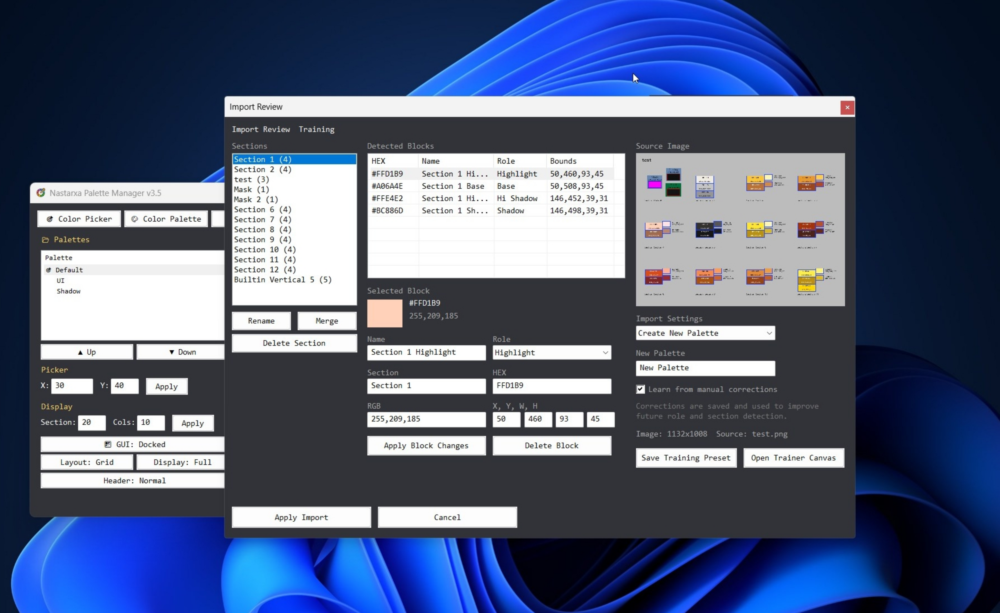
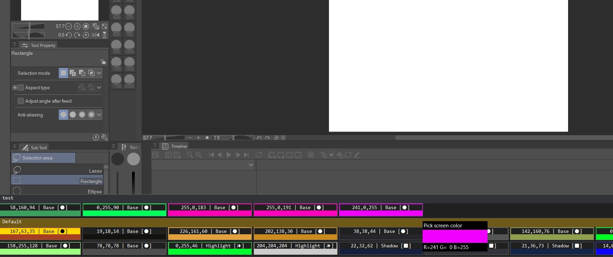
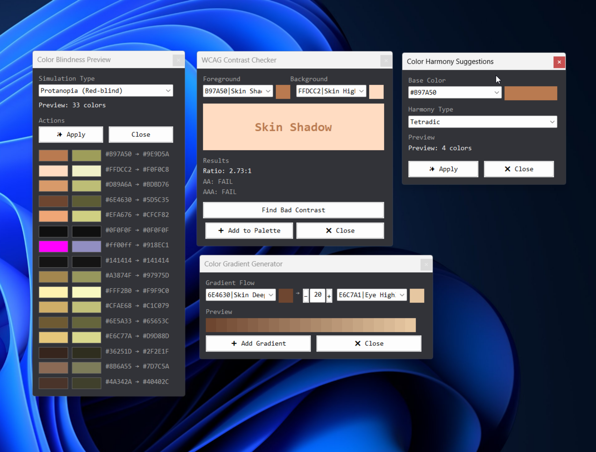

# 🎨 Nastarva Color Picker

Nastarva Color Picker is an AutoHotkey v2 tool for picking, organizing,
and exporting colors.

It is designed for character-sheet workflows, art references, and
palette systems, where colors are structured into palettes, sections,
and role-based shading systems like:

-   Base
-   Highlight
-   Shadow
-   Hi Shadow
-   2 Shadow

------------------------------------------------------------------------

## ✨ Features

### 🎯 Color Picking

-   Live screen color picker
-   HEX & RGB copy support
-   Middle click to save color
-   Ctrl + Middle click to copy RGB

### 🗂 Palette System

-   Multiple palettes stored in text format
-   Role-based color organization
-   Section-based micro palettes
-   Pinned colors with ordering system

### 🪟 UI System

-   Docked / Undocked section windows
-   Floating section panels
-   Drag & drop pinned colors between sections
-   Persistent panel positions per palette

### 🖼 Image-Based Workflow

-   Import palette from image file
-   Import palette from screenshot snip
-   Auto-detect color blocks
-   Best-effort OCR section naming
-   Auto-role assignment (heuristic)

### 📤 Export Formats

-   TXT
-   JSON
-   INI
-   CSV
-   PNG (with layout + labels)

------------------------------------------------------------------------

## 🖼 Image Preview










------------------------------------------------------------------------

## ⚙️ Requirements

-   Windows OS
-   AutoHotkey v2
-   PowerShell
-   Windows Snipping Tool (ms-screenclip support)

------------------------------------------------------------------------

## ⌨️ Main Hotkeys

  Hotkey              Action
  ------------------- ------------------------
  Ctrl + Alt + P      Toggle color picker
  Ctrl + Alt + O      Toggle color palette
  Ctrl + Alt + I      Toggle palette manager
  Ctrl + Alt + U      Screenshot import
  Ctrl + Alt + 1--9   Switch palettes

------------------------------------------------------------------------

## 🎛 Color Picker

  Input                 Action
  --------------------- -----------------
  Middle Click          Save + Copy HEX
  Ctrl + Middle Click   Copy RGB

------------------------------------------------------------------------

## 🎨 Color Palette

  Input               Action
  ------------------- -----------------------
  Left Click          Copy HEX
  Ctrl + Left Click   Copy RGB
  Right Click         Open menu
  Drag                Reorder pinned colors

------------------------------------------------------------------------

## 🔄 Workflow

1.  Pick colors live
2.  Organize into sections
3.  Assign roles
4.  Pin important colors
5.  Export palette

------------------------------------------------------------------------

## 🪟 GUI Modes

### Docked

-   Stacked sections
-   Fixed layout

### Undocked

-   Floating panels
-   Draggable windows

------------------------------------------------------------------------

## 📦 Export Formats

TXT, JSON, INI, CSV, PNG

PNG includes: - Palette name - Sections - Swatches - RGB - Roles

------------------------------------------------------------------------

## 📁 File Structure

Main script:

- [Nastarva Color Picker.ahk](Nastarva-Color-Picker/Nastarva%20Color%20Picker.ahk)

Core modules:

- [app_core.ahk](Nastarva-Color-Picker/src/core/app_core.ahk)
- [history_state.ahk](Nastarva-Color-Picker/src/core/history_state.ahk)
- [persistence.ahk](Nastarva-Color-Picker/src/core/persistence.ahk)

Feature modules:

- [picker.ahk](Nastarva-Color-Picker/src/features/picker.ahk)
- [history_gui.ahk](Nastarva-Color-Picker/src/features/history_gui.ahk)
- [palette_manager.ahk](Nastarva-Color-Picker/src/features/palette_manager.ahk)
- [palette_export.ahk](Nastarva-Color-Picker/src/features/palette_export.ahk)
- [palette_image_import.ps1](Nastarva-Color-Picker/src/features/palette_image_import.ps1)
- [palette_png_export.ps1](Nastarva-Color-Picker/src/features/palette_png_export.ps1)

Data:

- palette files are stored in `color\`
- palette order is stored in `color\palettes.txt`

------------------------------------------------------------------------

## 📜 Palette Format

Example:

```txt
#META|version=3.0|historyMax=20|maxCols=4|guiMode=undocked
#ROLEORDER|Base,Highlight,Shadow,Hi Shadow,2 Shadow
#SECTION|Default
#SECTION|Hair
FFCCAA|255,204,170|Hair Base|Base|1|1|Hair|171369999-1-1234
CC9966|204,153,102|Hair Shadow|Shadow|1|2|Hair|171369999-2-5678
```

Color row fields:

1. `hex`
2. `rgb`
3. `name`
4. `role`
5. `pinned`
6. `pinOrder`
7. `section`
8. `item id`

------------------------------------------------------------------------

## ⚠️ Notes

- Image role assignment is heuristic, not guaranteed
- OCR section naming is best-effort and depends on Windows OCR quality
- Imported palette layouts with unusual shapes may still need manual cleanup
- A screenshot import can differ by 1 RGB value from live picker if the captured image is slightly different from the exact on-screen pixel

------------------------------------------------------------------------

## ⚠️ Disclaimer

This project was developed with the assistance of AI tools.
AI was used to support code writing, refactoring, and documentation, while the design direction, features, and final implementation were guided and reviewed by the author.

------------------------------------------------------------------------

## ▶️ Running The Script

Run:

```powershell
AutoHotkey64.exe "D:\Github\Nastarva-Color-Picker\Nastarva Color Picker.ahk"
```
------------------------------------------------------------------------

## 📜 License

See [LICENSE](D:/Github/Nastarva-Color-Picker/LICENSE).
